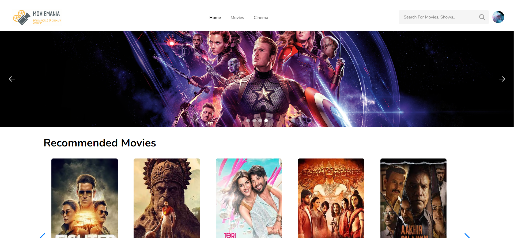
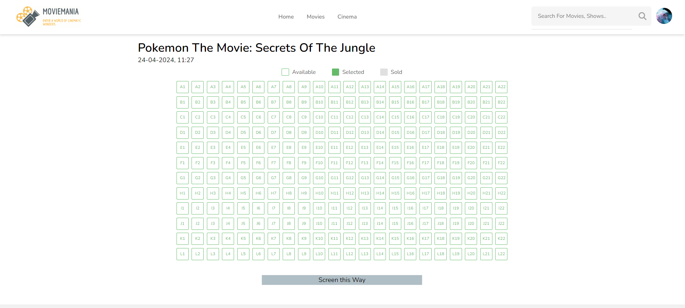
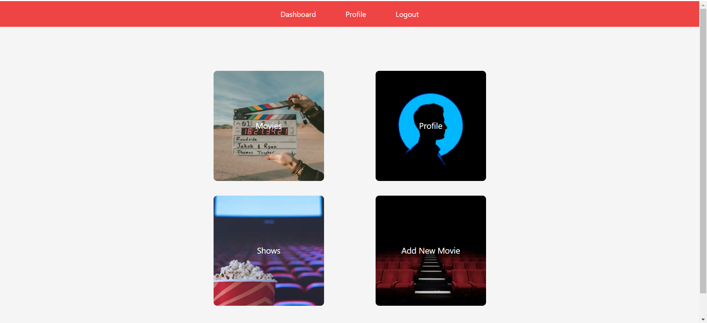
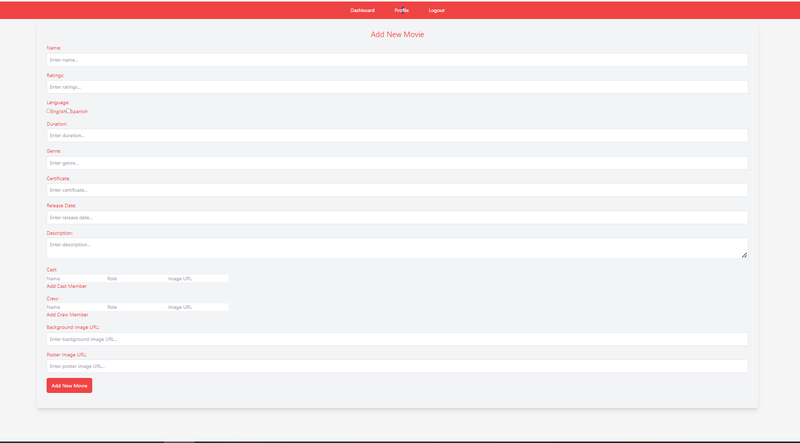
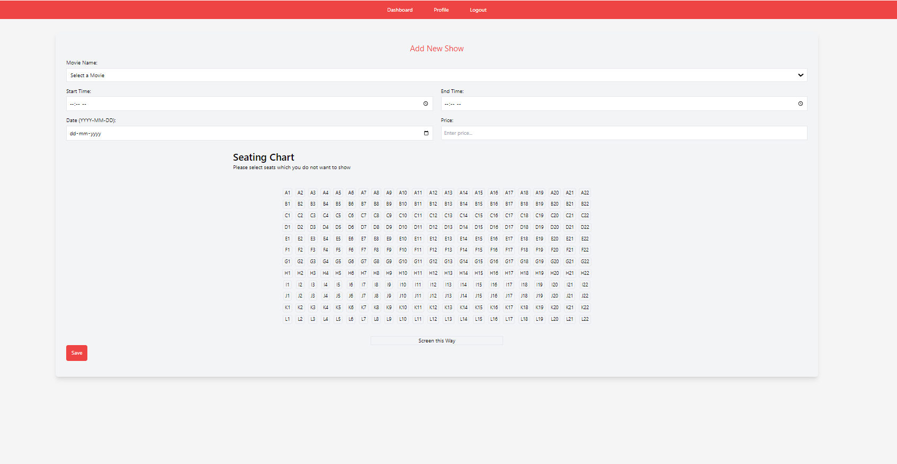

# MOVIE-TICKET-BOOKING
# Description
This project is a full-stack web application developed using the MERN (MongoDB, Express.js, React.js, Node.js) stack. It also utilizes Tailwind CSS for styling.

## Features-
### MERN Stack:-
Utilizes MongoDB as the database, Express.js and Node.js for the backend, and React.js for the frontend.
### Tailwind CSS: 
Provides a utility-first CSS framework for styling, allowing for rapid UI development.

## Installation
### Clone the repository
 ```bash
git clone https://github.com/upaliwal1234/Movie-Ticket-Booking
```
### Install dependencies:
```bash
cd your-project
npm install
```
### Set up environment variables:
Create a .env file in the root directory and add the necessary environment variables, such as database connection URI, API keys, etc.

### Start the frontend:
```bash
npm run dev
```
### Start the Admin frontend:
```bash
npm run dev
```
### Start the development server:
```bash
npm start
```
## Usage
Access the application by navigating to http://localhost:5173 in your web browser.
Access the admin portal by navigating to http://localhost:5174 in your web browser.

## License
This project is licensed under the MIT License.

## Credits
Developed by Utkarsh Paliwal, Utkarsh Goyal, Shubham Saurav, Sparsh Singh.

## Support
For support, contact ukgoyal123@gmail.com.

## Home Page


## Seat Selection


## Admin Dashboard


## Add Movie


## Add Show

